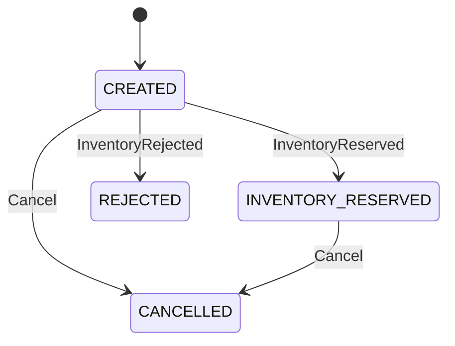

# Order Service

Spring Boot microservice responsible for order creation, retrieval, pagination,
cancellation, and lifecycle updates from inventory events.

## Responsibilities

- Expose the Order REST API
- Persist orders and order items in PostgreSQL
- Publish `OrderCreated` and `OrderCancelled` through a transactional outbox
- Consume inventory results idempotently
- Protect concurrent updates with optimistic locking
- Expose health checks and Prometheus metrics

## API

| Method | Endpoint | Description |
|---|---|---|
| `POST` | `/api/orders` | Create an order |
| `GET` | `/api/orders/{id}` | Retrieve an order |
| `GET` | `/api/orders?page=0&size=20` | List order summaries |
| `POST` | `/api/orders/{id}/cancel` | Cancel an order |
| `GET` | `/actuator/health` | Service health |
| `GET` | `/actuator/prometheus` | Prometheus metrics |

## Order lifecycle



## Events produced

### OrderCreated

Contains the event ID, order ID, customer, items, total amount, occurrence time,
and event-contract version.

### OrderCancelled

Contains the event ID, order ID, occurrence time, and event-contract version.

Both use the order ID as their Kafka key.

## Events consumed

`InventoryResult` transitions a created order to either
`INVENTORY_RESERVED` or `REJECTED`. Duplicate event IDs are ignored, and late
inventory results cannot overwrite a cancelled order.

## Reliability

- Flyway owns all schema changes.
- Order and outbox rows commit in one PostgreSQL transaction.
- Outbox records are marked published only after Kafka acknowledgement.
- Consumers store event IDs in `processed_events`.
- `@Version` provides optimistic locking.
- Testcontainers verifies PostgreSQL and Kafka integration.

## Run locally

Requirements:

- Java 21
- Docker Desktop

Start PostgreSQL and Kafka:

```powershell
docker compose up -d postgres kafka
```

Run tests:

```powershell
.\mvnw.cmd clean test
```

Start the service:

```powershell
.\mvnw.cmd spring-boot:run
```

The API is available at `http://localhost:8080`.

For the complete two-service environment, use the sibling
`commerce-platform` repository.